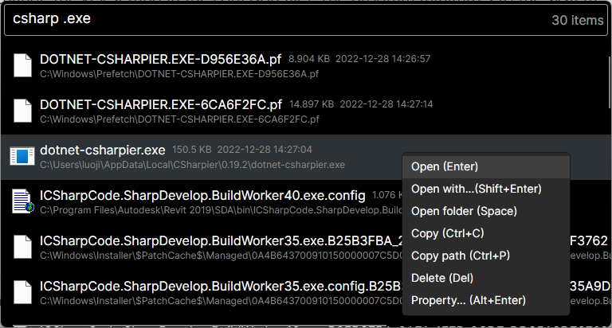
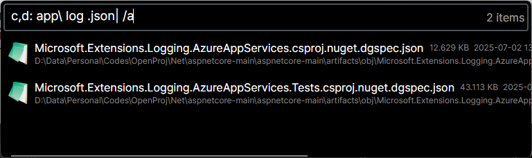

# TDS - The Ultimate Windows File Finder
# TDS - 便捷的 Windows 文件查找工具

[2025.1.1.14] Welcome to TDS, your go-to tool for lightning-fast file searches on Windows systems.
[2025.1.1.14] 欢迎使用 TDS，您在 Windows 系统上进行极速文件搜索的首选工具。

(Tip:Support Pinyin Initial Abbreviation Translation. The interface language can be set to English.)
（提示：支持拼音首字母缩写翻译。软件界面使用语言可选择中文-简体）

  

Sample: List all the files with the name contains "log" and ended with ".json" in the folder "App" from disks "c:" and "d:"  
示例：列出磁盘 "c:" 和 "d:" 中 "App" 文件夹下名称包含 "log" 且以 ".json" 结尾的所有文件  

You can type: c,d: App\ log .json| /a  
您可以输入：c,d: App\ log .json| /a

## Overview
## 概述

TDS is a powerful, efficient, and user-friendly application designed to help you quickly locate and manage files on your Windows system. It is developed using the latest C# 9 and Avalonia UI technologies and compiled under AOT (Ahead-Of-Time) for optimal performance.
TDS 是一款功能强大、高效且用户友好的应用程序，旨在帮助您快速定位和管理 Windows 系统上的文件。它采用最新的 C# 9 和 Avalonia UI 技术开发，并通过 AOT 编译以实现最佳性能。

Now it is a single .exe file around 20MB!
现在它是一个大小约 20MB 的单个 .exe 文件！

## Features
## 功能特点

- **Speed**: Ultra-fast search capabilities to find files in the blink of an eye.
- **速度**：超快的搜索能力，眨眼间找到文件。
- **Compact**: Lightweight and efficient, ensuring minimal system resource usage.
- **小巧**：轻量高效，确保系统资源占用最小。
- **Powerful**: Perform a variety of operations with ease, including:
- **强大**：轻松执行各种操作，包括：
  - Opening files and directories
  - 打开文件和目录
  - Copying files
  - 复制文件
  - Viewing file properties
  - 查看文件属性
- **User-Friendly**: Intuitive and aesthetically pleasing interface that is both functional and visually appealing.
- **用户友好**：直观且美观的界面，既实用又吸引人。
- **Cross-Platform**: Built with Avalonia UI, ensuring compatibility across different platforms.
- **跨平台**：使用 Avalonia UI 构建，确保跨平台兼容性。
- **Region Screenshot (integrated)**: Built-in area capture with annotation tools — see the section below.
- **区域截屏（已整合）**：内置选区截屏与标注工具，详见下文。

## Region Screenshot (integrated)
## 区域截屏（整合说明）

TDS includes a **region screenshot** tool under `TDSAot/ScreenShot/`. It is independent from the main search window: separate hotkey, separate fullscreen UI, and no impact on file search.

TDS 内置**区域截屏**功能，源码位于 `TDSAot/ScreenShot/`。与主搜索窗口**相互独立**：独立快捷键、独立全屏界面，不影响文件搜索。

### How to enable
### 如何启用

1. Open **Options** from the tray menu or main window.
1. 从托盘菜单或主窗口打开**选项**。
2. Check **Enable region screenshot** / **启用区域截屏**, adjust the hotkey if needed, then click **OK**.
2. 勾选**启用区域截屏**，可按需修改快捷键，点击**确定**保存。
3. The screenshot hotkey is registered only while the feature is enabled.
3. 仅在该功能开启时才会注册截屏全局热键。

### Default hotkey
### 默认快捷键

- **Alt + Shift + A** — independent from the main window hotkey (**Ctrl + ~**).
- **Alt + Shift + A** — 与主窗口唤出快捷键（**Ctrl + ~**）互不冲突。

You can change the key and modifier in Settings (letters A–Z, F1–F12, and modifier combinations such as Ctrl+Shift / Alt+Shift).
可在设置中修改按键与修饰键（字母 A–Z、F1–F12，以及 Ctrl+Shift、Alt+Shift 等组合）。

### Capture workflow
### 截屏流程

1. Press the screenshot hotkey. TDS hides its main window briefly so it is not captured.
1. 按下截屏快捷键。TDS 会短暂隐藏主窗口，避免将其拍入画面。
2. Drag to select a region on the fullscreen overlay. Use the toolbar to annotate (rectangle, ellipse, arrow, text, etc.) or adjust the selection.
2. 在全屏遮罩上拖拽框选区域，可用工具栏标注（矩形、椭圆、箭头、文字等）或调整选区。
3. **Confirm** — copies the result to the clipboard (PNG/DIB, pasteable in Paint, Word, etc.).
3. **确认** — 将结果复制到剪贴板（PNG/DIB，可粘贴到画图、Word 等）。
4. **Save** — opens a file save dialog to export a PNG file.
4. **保存** — 弹出文件保存对话框，导出 PNG 文件。
5. **Cancel** or **Esc** — discards and closes the overlay.
5. **取消** 或 **Esc** — 放弃并关闭截屏界面。

### Configuration
### 配置项

Screenshot options are stored in the same `conf.json` as other TDS settings:

截屏相关选项与其他 TDS 设置一起保存在 `conf.json` 中：

| Key | Default | Description |
|-----|---------|-------------|
| `ScreenshotEnabled` | `false` | Enable region screenshot / 启用区域截屏 |
| `ScreenshotHotKey` | `65` (A) | Virtual key code / 虚拟键码 |
| `ScreenshotModifierKey` | `5` (Alt+Shift) | Modifier flags / 修饰键组合 |

### Developer notes
### 开发者说明

- **Entry**: `TDS.Screenshot.ScreenshotHost` — triggered from global hotkey id `9528`.
- **入口**：`TDS.Screenshot.ScreenshotHost`，由全局热键 ID `9528` 触发。
- **UI**: `TDS.ScreenShot.UI` — fullscreen `ScreenshotWindow`, toolbar, annotation canvas.
- **界面**：`TDS.ScreenShot.UI` — 全屏 `ScreenshotWindow`、工具栏、标注画布。
- **Capture**: `TDS.ScreenShot.Core.Capture` — Win32 virtual-desktop capture.
- **捕获**：`TDS.ScreenShot.Core.Capture` — Win32 虚拟桌面截屏。

## Installation
## 安装

1. Download the latest release from the Releases page.
1. 从 Releases 页面下载最新版本。
2. Extract the downloaded archive to your desired location.
2. 将下载的压缩包解压到所需位置。
3. Run the executable file to start using TDS.
3. 运行可执行文件以开始使用 TDS。

## Usage
## 使用方法

- **Search for Files**: Simply type in your search query and TDS will instantly display the matching files. Use "space" to split the keywords.
- **搜索文件**：只需输入搜索查询，TDS 将立即显示匹配的文件。使用"空格"分隔关键词。
- **Open Files/Directories**: Double-click on a file or directory to open it directly.
- **打开文件/目录**：双击文件或目录即可直接打开。
- **Copy Files**: Right-click on a file and select "Copy" to copy it to your clipboard.
- **复制文件**：右键单击文件并选择"复制"将其复制到剪贴板。
- **View Properties**: Right-click on a file and select "Properties" to view detailed information about the file.
- **查看属性**：右键单击文件并选择"属性"以查看文件的详细信息。
- **Hotkey**: The default activation window key is **Ctrl+~** (changeable in Settings or `conf.json`). Screenshot uses **Alt+Shift+A** when enabled (see **Region Screenshot** above). The program minimizes to the system tray after startup by default. ESC focuses and selects the input box text; press again to clear. Ctrl opens the context menu of the selected item.
- **热键**：默认唤出主窗口为 **Ctrl+~**（可在设置或 `conf.json` 中修改）。截屏功能开启后默认为 **Alt+Shift+A**（详见上文**区域截屏**）。程序启动后默认最小化到系统托盘。ESC 可快速聚焦并选中输入框文本，再按一次清除。Ctrl 键打开选中项的上下文菜单。

## Contributing
## 贡献

TDS is open-sourced! We welcome any contributions, suggestions, and feedback to help improve the application. Stay tuned for the open-source release and feel free to fork the repository and submit pull requests.
TDS 是开源的！我们欢迎任何贡献、建议和反馈，以帮助改进应用程序。敬请期待开源发布，并随时 Fork 代码库并提交 Pull Request。

## License
## 许可证

TDS is currently totally free with MIT license.
TDS 目前完全免费，使用 MIT 许可证。

## Contact
## 联系我们

For any questions, suggestions, or feedback, please feel free to open an issue on this repository or contact us directly.
如有任何问题、建议或反馈，请随时在此代码库提交 Issue 或直接联系我们。

Thank you for choosing TDS! We hope it makes your file management experience seamless and enjoyable!
感谢您选择 TDS！我们希望它能让您的文件管理体验无缝且愉快！
