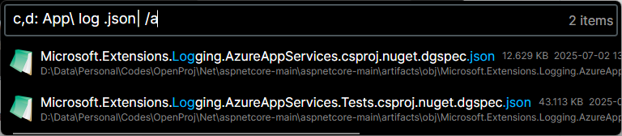

# TDS - The Ultimate Windows File Finder
# TDS - 便捷的 Windows 文件查找工具

[2025.1.1.12] Welcome to TDS, your go-to tool for lightning-fast file searches on Windows systems.
[2025.1.1.12] 欢迎使用 TDS，您在 Windows 系统上进行极速文件搜索的首选工具。

(Tip:Support Pinyin Initial Abbreviation Translation.)
（提示：支持拼音首字母缩写翻译。）

  

Sample: List all the files with the name contains "log" and ended with ".json" in the folder "App" from disks "c:" and "d:"  
示例：列出磁盘 "c:" 和 "d:" 中 "App" 文件夹下名称包含 "log" 且以 ".json" 结尾的所有文件  

You can type: c,d: App\ log .json| /a  
您可以输入：c,d: App\ log .json| /a

## Overview
## 概述

TDS is a powerful, efficient, and user-friendly application designed to help you quickly locate and manage files on your Windows system. It is developed using the latest C# 9 and Avalonia UI technologies and compiled under AOT (Ahead-Of-Time) for optimal performance.
TDS 是一款功能强大、高效且用户友好的应用程序，旨在帮助您快速定位和管理 Windows 系统上的文件。它采用最新的 C# 9 和 Avalonia UI 技术开发，并通过 AOT 编译以实现最佳性能。

Now it is a single .exe file around 20MB!
现在它是一个大小约 20MB 的单个 .exe 文件！

## Features
## 功能特点

- **Speed**: Ultra-fast search capabilities to find files in the blink of an eye.
- **速度**：超快的搜索能力，眨眼间找到文件。
- **Compact**: Lightweight and efficient, ensuring minimal system resource usage.
- **小巧**：轻量高效，确保系统资源占用最小。
- **Powerful**: Perform a variety of operations with ease, including:
- **强大**：轻松执行各种操作，包括：
  - Opening files and directories
  - 打开文件和目录
  - Copying files
  - 复制文件
  - Viewing file properties
  - 查看文件属性
- **User-Friendly**: Intuitive and aesthetically pleasing interface that is both functional and visually appealing.
- **用户友好**：直观且美观的界面，既实用又吸引人。
- **Cross-Platform**: Built with Avalonia UI, ensuring compatibility across different platforms.
- **跨平台**：使用 Avalonia UI 构建，确保跨平台兼容性。

## Installation
## 安装

1. Download the latest release from the Releases page.
1. 从 Releases 页面下载最新版本。
2. Extract the downloaded archive to your desired location.
2. 将下载的压缩包解压到所需位置。
3. Run the executable file to start using TDS.
3. 运行可执行文件以开始使用 TDS。

## Usage
## 使用方法

- **Search for Files**: Simply type in your search query and TDS will instantly display the matching files. Use "space" to split the keywords.
- **搜索文件**：只需输入搜索查询，TDS 将立即显示匹配的文件。使用"空格"分隔关键词。
- **Open Files/Directories**: Double-click on a file or directory to open it directly.
- **打开文件/目录**：双击文件或目录即可直接打开。
- **Copy Files**: Right-click on a file and select "Copy" to copy it to your clipboard.
- **复制文件**：右键单击文件并选择"复制"将其复制到剪贴板。
- **View Properties**: Right-click on a file and select "Properties" to view detailed information about the file.
- **查看属性**：右键单击文件并选择"属性"以查看文件的详细信息。
- **Hotkey**:  The default activation window key is Ctrl+~ (You can change the key setting in the conf.json file). The program minimizes to the system tray in the lower right corner after startup by default. The ESC key can quickly focus and select the text in the input box. Pressing it again clears the text. Ctrl to open the ContextMenu of selected item.
- **热键**：默认激活窗口按键为 Ctrl+~（您可以在 conf.json 文件中更改按键设置）。程序启动后默认最小化到右下角系统托盘。ESC 键可以快速聚焦并选中输入框中的文本。再次按下则清除文本。Ctrl 键打开选中项的上下文菜单。

## Contributing
## 贡献

TDS is open-sourced! We welcome any contributions, suggestions, and feedback to help improve the application. Stay tuned for the open-source release and feel free to fork the repository and submit pull requests.
TDS 是开源的！我们欢迎任何贡献、建议和反馈，以帮助改进应用程序。敬请期待开源发布，并随时 Fork 代码库并提交 Pull Request。

## License
## 许可证

TDS is currently totally free with MIT license.
TDS 目前完全免费，使用 MIT 许可证。

## Contact
## 联系我们

For any questions, suggestions, or feedback, please feel free to open an issue on this repository or contact us directly.
如有任何问题、建议或反馈，请随时在此代码库提交 Issue 或直接联系我们。

Thank you for choosing TDS! We hope it makes your file management experience seamless and enjoyable!
感谢您选择 TDS！我们希望它能让您的文件管理体验无缝且愉快！